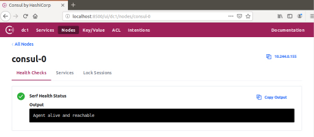

# Running Consul Dev on Kubernetes
(Inspired by [consul-on-kubernetes](https://github.com/kelseyhightower/consul-on-kubernetes))

This tutorial will walk you through deploying a single (1) node [Consul](https://www.consul.io) cluster on Kubernetes.

## Overview

* Single node Consul cluster using a [StatefulSet](http://kubernetes.io/docs/concepts/abstractions/controllers/statefulsets)

## Prerequisites

This tutorial leverages features available in Kubernetes 1.11.0 and later.

* [kubernetes](http://kubernetes.io/docs/getting-started-guides/binary_release) 1.11.x

```
gcloud container clusters create consul \
  --cluster-version 1.11.2-gke.9
```

The following clients must be installed on the machine used to follow this tutorial:

* [consul](https://www.consul.io/downloads.html) 1.4.0-rc

## Usage

Clone this repo:

```
kubectl create -f https://raw.githubusercontent.com/AsCat/consul-dev-on-kubernetes/master/consul-dev.yaml
```

Consul will be created . Verify consul is `Running` before moving to the next step.

```
kubectl get pods
```
```
NAME       READY     STATUS    RESTARTS   AGE
consul-0   1/1       Running   0          20s
```

### Verification

At this point the Consul cluster has been bootstrapped and is ready for operation. To verify things are working correctly, review the logs for one of the cluster members.

```
kubectl logs consul-0
```

The consul CLI can also be used to check the health of the cluster. In a new terminal start a port-forward to the `consul-0` pod.

```
kubectl port-forward consul-0 8500:8500
```
```
Forwarding from 127.0.0.1:8500 -> 8500
Forwarding from [::1]:8500 -> 8500
```

Run the `consul members` command to view the status of each cluster member.

```
consul members
```
```
Node      Address          Status  Type    Build     Protocol  DC   Segment
consul-0  10.32.2.8:8301   alive   server  1.4.0rc1  2         dc1  <all>
```

### Accessing the Web UI

The Consul UI does not support any form of authentication out of the box so it should not be exposed. To access the web UI, start a port-forward session to the `consul-0` Pod in a new terminal.

```
kubectl port-forward consul-0 8500:8500
```

Visit http://127.0.0.1:8500 in your web browser.



## Cleanup

Run the `cleanup` script to remove the Kubernetes resources created during this tutorial:

```
bash cleanup
```
